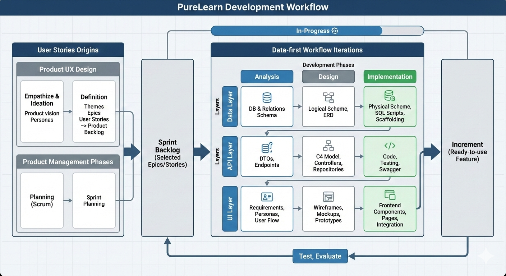

# **PureLearn Development Workflow** `In-Progress ⚙️`

> Overview: `Completed ✅`
>
> 1. **Layers:**
>    - **data layer:** Database & Relations...
>    - **API Layer:** Dtos, Logic, Data Access, endpoints...
>    - **UI Layer:** UI Design, UI Development.
> 2. **Development Phases:**
>    - Analysis
>    - Design
>    - Implementation
>    - Test, Evaluate
> 3. **phases x layer = Data-first Workflow**
>
>    - Data Layer {Analysis, Design, Implementation};
>    - API Layer {Analysis, Design, Implementation};
>    - UI Layer: {Analysis, Design, Implementation};
>
> 4. **Data-first Workflow Iterations on _Selected_ (Epics/group of related user stories)**
>    - **(Epics/group of related user stories)** x work flow = Increment (Ready-to-use Feature)
> 5. **Where user Stories com from?**
>    1. **Product UX Design phases**
>       1. Empathize & Ideation
>          1. Product vision
>          2. Personas
>       2. Definition
>          1. Themes
>          1. Epics
>          1. Userstories (Product backlog)
>    2. **Product Management Phases**
>       1. Planning (Scrum Framwork) => sprint planning (Selecting (Epics/group of related user stories))
>
> 

## **1.** [**Ideation & Definition**](<../1.  ideation & planning>) `To-do 🎯`

Artifacts:

1. [Prodcut Vision](<../1.  ideation & planning/1. Product Vision.md>) `Stratigic`
2. [Themes](<../1.  ideation & planning/2. Themes.md>)`Stratigic`
3. [Epics](<../1.  ideation & planning/3. Epics.md>)`Stratigic`
4. [User stories](<../1.  ideation & planning/4. Product Backlog.xlsx>)

### **Sources of Input**

- **[MindMap](docs/Mindmap)**
- **Additional Inputs:**
  - [Team Brainstorming Meetings](https://discord.com/channels/1299649170965135360/1304127482215268453)
  - [Competitor Analysis from [2. prompt sheet] ](https://shaedu-my.sharepoint.com/:x:/g/personal/322223887_sha_edu_eg/EXpawZtbkkNEnLTxyfj3mygBFqBjSf25JH3_d2dJOZfWcQ?e=3eDieX)
  - [AI Insights](https://chatgpt.com/)

## **2. PROCESS: Development Breakdown**

### **High-Level Planning**

1. [Identify Major Themes → Epics → Component Groups](https://shaedu-my.sharepoint.com/:x:/g/personal/322223887_sha_edu_eg/EXpawZtbkkNEnLTxyfj3mygBFqBjSf25JH3_d2dJOZfWcQ?e=3eDieX)
2. [Conduct Sprint Planning Meeting](https://discord.com/channels/1299649170965135360/1304127482215268453)

### **Extract Key Elements**

- **Database**

  - Define Entities, Relationships, and Attributes using inputs
  - Use [Database Build](https://database.build/db/pg4i6qjrd0fx29fm) for structure analysis & assistant.

- **Backend**

  - Define API Endpoints & DTOs for each entity

- **UI/UX Design**

  - ~~Requirement analysis & Research~~
  - ~~Personas~~
  - User Journey & Flowcharts
  - Information Architecture
  - Wireframe
  - Mockup
  - Prototype
  - Create and iterate wireframes
  - Develop high-fidelity prototypes
  - Define design system (Typography, Color Palette, Components)
  - **UI Design Reference**:
    - [Mobil UI Design Prototype](https://www.figma.com/proto/zSX1hrAACeHMjNBHVj7E5Q/Pure-Learn-Mobile-UI?page-id=0%3A1&node-id=31-17&p=f&viewport=189%2C43%2C0.34&t=PgKHtGcTvfo4QMB4-1&scaling=scale-down&content-scaling=fixed&starting-point-node-id=31%3A17)
    - [Web UI Design (Not-Started)](https://www.figma.com/proto/zSX1hrAACeHMjNBHVj7E5Q/Pure-Learn-Mobile-UI?node-id=34-22&t=7utWEtpwKHrcuHhh-1&starting-point-node-id=34%3A22)

- **Frontend Development**

  - Identify Required Components & Pages
  - Develop Components & Pages
  - Implement Views:
    - **Task List, Kanban Board, Eisenhower Matrix, Time-Task View**

- **Frontend (Android)**

  - **Jetpack Compose** – A modern UI toolkit for building native Android UI declaratively.
  - **Dagger Hilt** – A dependency injection framework for efficient dependency management.
  - **Coroutines & Flow**

    - **Coroutines** – Handles asynchronous operations efficiently.
    - **StateFlow & SharedFlow** – Ensures reactive UI updates and real-time data flow.

  - **Architecture & Design Patterns**

    - **MVVM (Model-View-ViewModel)** – Enhances separation of concerns for better maintainability.

  - **Networking**
    - **Retrofit & Ktor**
      - **Retrofit** – Manages API requests with Moshi for JSON serialization/deserialization.
      - **Ktor** – A lightweight HTTP client used for network requests and WebSockets.

- **AI Development**
  - Implement AI-driven learning recommendations, task automation, and optimization

## **3. OUTPUT (PHASES)**

## 1 Analysis & Specification\*\*

### **Database (Relational)**

- **Entities** (Attributes, Relationships)

### **Backend**

- API Endpoints & DTOs
- Business logic
- potiential feature

### **UI/UX** (Figma, Relume, Shadcn UI)

- Sitemap
- Wire frames

### **Frontend** (NEXT.js, Tailwindcss, Shadcn UI)

- Component Breakdown & Pages Structure

## 2. Design ✅

### **Database (Relational)**

- **ERD Logical Schema**: [ERD on dbdiagram.io](https://dbdiagram.io/d/Pure-learn-6755b24ee9daa85aca085b40)

### **Backend**

- [**C4 Model - Component Level**:](docs/c4-model-architecture)
- Tools: Structurizr, DSL

### **UI/UX**

- Mockups

### **Frontend**

- **Component Breakdown**:

  - [C4 Model - SPA & Mobile](https://github.com/Gemaxx/pure-learn/tree/main/C4%20Model)
    - Tools: Structurizr, DSL

- [`UI Design`](https://www.figma.com/design/aVgTgzWrKU7V51XOj09k7y1/purelearn?node-id=1-50&node-type=frame&t=79cGvFbzOZRLxnij-0)
  - Tools: Figma

## **2. DEVELOPMENT**

### **Database (SQL Server - Azure SQL)**

- **Physical Schema**
- **Tools**: -[Database Build](https://database.build/db/pg4i6qjrd0fx29fm)
  - SSMS

### **Backend**

1. Convert tables from the database to [Models](Models) and set up [DbContext](Data/PureLearnDbContext.cs) in the [Data Directory](Data) using scaffolding:
   ```sh
   dotnet ef dbcontext scaffold "Name=DefaultConnection" Microsoft.EntityFrameworkCore.SqlServer -o Models
   ```
2. Define [DTOs](Dtos) for different endpoints as needed, for example:
   - **Read DTO Requests**
     - `EntityDto` (for list view)
     - `EntityDetailsDto` (for details view of a specific entity)
   - **Write DTO Requests**
     - `CreateEntityRequestDto`
     - `PatchEntityRequestDto`
3. Configure Manual [Mapper](Mapper)
4. Create Repository [Interfaces](Interfaces)
5. Create QueryObject in [Helpers Dir](Helpers) for filtering and sorting operations for entities.
6. Implement [Repository](Repos)
7. Create [Controllers](Controllers)
8. Register Dependencies in [Program.cs file](Program.cs)
9. 🎉 🚀 We are Done, Happy Coding!!! ✨

### **UI/UX Design**

- Information Architecture
- Wireframing
- High-Fidelity Design in Figma
- User Testing & Iteration
- Design System Implementation

### **Frontend Development**

- Develop Components & Pages
- Implement Views:
  - **Task List, Kanban Board, Eisenhower Matrix, Time-Task View**
- Utilize AI for UI optimization

## **3. DEPLOYMENT** 🚀✅

- **Database:** [Azure SQL Database](https://azure.microsoft.com/en-us/products/azure-sql-database/) (Serverless, pay-as-you-go)
- **Backend:** [Azure App Service](https://azure.microsoft.com/en-us/products/app-service/) (Pay-as-you-go)
- **Frontend:** [Vercel Hobby Tier](https://vercel.com/)
- **AI Integration:** TBD
