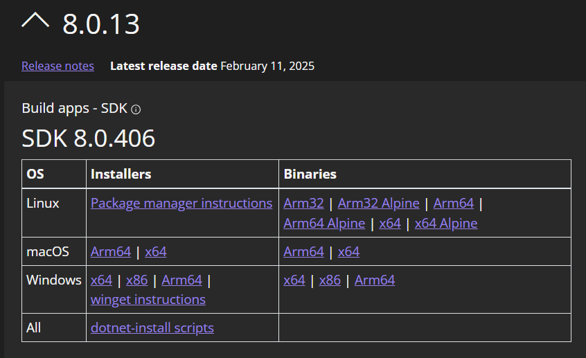

# Sequence of Backend Development

## Project Setup

1. Clone the repository:

   ```sh
   git clone https://github.com/your-repo/pure-learn.git
   cd pure-learn/api
   ```

2. If you dont have dotnet SDK 8.0.406 installed, install from [here](https://dotnet.microsoft.com/en-us/download/dotnet/8.0)
   

3. make sure you are inside [api directory](.)
   ```sh
   PS D:\pure-learn> cd api
   PS D:\pure-learn\api>
   ```
4. Install dependencies:

   ```sh
   dotnet restore
   ```

5. Set up the database there is 2 ways:

   1. Working on hosted db ✅
      we're already workin on Azure. (u dont need to do any action)
   2. or you can use SQL Server Express (local db) 🚀🔥

   - Create local DB in SQL Server Express
   - Update the connection string in [appsettings.json](appsettings.json)
   - Run the database migrations:

     ```sh
     dotnet ef database update
     ```

## Running the Application

1. make sure you are inside [api directory](.)
   ```sh
   PS D:\pure-learn> cd api
   PS D:\pure-learn\api>
   ```
2. Start the backend service:

   ```sh
   dotnet watch run
   ```

3. The application will be available at:

   - HTTP: http://localhost:5115

4. You can access the Swagger UI for API documentation at: http://localhost:5115/swagger

## Docker Setup

1. 1. make sure you are inside [api directory](.)
   ```sh
   PS D:\pure-learn> cd api
   PS D:\pure-learn\api>
   ```
2. Build and run the Docker container:

   ```sh
   docker-compose build
   docker-compose up
   ```

3. The application will be available at:

   - HTTP: http://localhost:5115

4. You can access the Swagger UI for API documentation at: http://localhost:5115/swagger

## Testing

Not Yet

## Development

1. Convert tables from the database to [Models](Models) and set up [DbContext](Data/PureLearnDbContext.cs) in the [Data Directory](Data) using scaffolding:

   ```sh
   dotnet ef dbcontext scaffold "Name=DefaultConnection" Microsoft.EntityFrameworkCore.SqlServer -o Models
   ```

2. Define [Dtos](Dtos) for different endpoints as needed, for exaple

- Read Dto Requests
  - "Entity"Dto (for list view)
  - "Entity"DetailsDto (for details view of specific entity)
- Write Dto Requests
  - Create"Entity"RequestDto
  - Patch"Entity"RequestDto

4. Configure Manual [Mapper](Mapper)
5. Create Repository [Interfaces](Interfaces)
6. Create QueryObject in [Helpers Dir](Helpers) for filtering and sort operations for entities.
7. Implement [Repository](Repos)
8. Create [Controllers](Controllers)
9. Register Dependencies in [Program.cs file](Program.cs)
10. 🎉 🚀 We are Done, Happy Coding !!!✨
